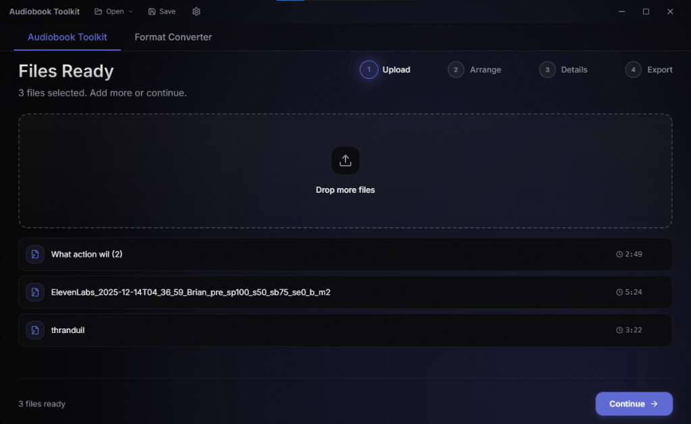

<div align="center">
    <a href="https://github.com/Zendevve/audiobook-toolkit" target="_blank">
        
    </a>
</div>

<h1 align="center">Audiobook Toolkit</h1>

<div align="center">

[![PRG Gold](https://img.shields.io/badge/PRG-Gold%20Project-FFD700?style=for-the-badge&logo=data:image/svg%2bxml;base64,PD94bWwgdmVyc2lvbj0iMS4wIiBzdGFuZGFsb25lPSJubyI/Pgo8IURPQ1RZUEUgc3ZnIFBVQkxJQyAiLS8vVzNDLy9EVEQgU1ZHIDIwMDEwOTA0Ly9FTiIKICJodHRwOi8vd3d3LnczLm9yZy9UUi8yMDAxL1JFQy1TVkctMjAwMTA5MDQvRFREL3N2ZzEwLmR0ZCI+CjxzdmcgdmVyc2lvbj0iMS4wIiB4bWxucz0iaHR0cDovL3d3dy53My5vcmcvMjAwMC9zdmciCiB3aWR0aD0iMjYuMDAwMDAwcHQiIGhlaWdodD0iMzQuMDAwMDAwcHQiIHZpZXdCb3g9IjAgMCAyNi4wMDAwMDAgMzQuMDAwMDAwIgogcHJlc2VydmVBc3BlY3RSYXRpbz0ieE1pZFlNaWQgbWVldCI+Cgo8ZyB0cmFuc2Zvcm09InRyYW5zbGF0ZSgwLjAwMDAwMCwzNC4wMDAwMDApIHNjYWxlKDAuMTAwMDAwLC0wLjEwMDAwMCkiCmZpbGw9IiNGRkQ3MDAiIHN0cm9rZT0ibm9uZSI+CjxwYXRoIGQ9Ik0xMiAzMjggYy04IC04IC0xMiAtNTEgLTEyIC0xMzUgMCAtMTA5IDIgLTEyNSAxOSAtMTQwIDQyIC0zOCA0OAotNDIgNTkgLTMxIDcgNyAxNyA2IDMxIC0xIDEzIC03IDIxIC04IDIxIC0yIDAgNiAyOCAxMSA2MyAxMyBsNjIgMyAwIDE1MCAwCjE1MCAtMTE1IDMgYy04MSAyIC0xMTkgLTEgLTEyOCAtMTB6IG0xMDIgLTc0IGMtNiAtMzMgLTUgLTM2IDE3IC0zMiAxOCAyIDIzCjggMjEgMjUgLTMgMjQgMTUgNDAgMzAgMjUgMTQgLTE0IC0xNyAtNTkgLTQ4IC02NiAtMjAgLTUgLTIzIC0xMSAtMTggLTMyIDYKLTIxIDMgLTI1IC0xMSAtMjIgLTE2IDIgLTE4IDEzIC0xOCA2NiAxIDc3IDAgNzIgMTggNzIgMTMgMCAxNSAtNyA5IC0zNnoKbTExNiAtMTY5IGMwIC0yMyAtMyAtMjUgLTQ5IC0yNSAtNDAgMCAtNTAgMyAtNTQgMjAgLTMgMTQgLTE0IDIwIC0zMiAyMCAtMTgKMCAtMjkgLTYgLTMyIC0yMCAtNyAtMjUgLTIzIC0yNiAtMjMgLTIgMCAyOSA4IDMyIDEwMiAzMiA4NyAwIDg4IDAgODggLTI1eiIvPgo8L2c+Cjwvc3ZnPgo=)](https://github.com/scottgriv/PRG-Personal-Repository-Guidelines)
[](LICENSE)
[](https://www.electronjs.org/)
[](https://reactjs.org/)
[](https://www.typescriptlang.org/)

[Download Prebuilt Binary](https://zendevve.gumroad.com/l/audiobook-toolkit) · [Report Bug](https://github.com/Zendevve/audiobook-toolkit/issues) · [Support Development](https://github.com/sponsors/Zendevve)

</div>

---------------

A comprehensive, open-source desktop application for managing and upgrading your audiobook collection. Merge scattered MP3s into chapterized M4Bs, split excessively large files, convert formats, and fix compatibility issues for legacy devices—all in a beautiful, dark-mode interface.



## Table of Contents

- [Features](#features)
- [Background Story](#background-story)
- [Tech Stack](#tech-stack)
- [Getting Started](#getting-started)
- [Documentation](#documentation)
- [Philosophy: Open Core](#philosophy-open-core)
- [What's Inside?](#whats-inside)
- [Contributing](#contributing)
- [License](#license)
- [Footer](#footer)

## Features

- **📚 Audiobook Binder**: Merge multiple audio files (MP3, M4A, etc.) into a single, chapterized M4B audiobook.
- **✂️ Chapter Splitter**: Losslessly split large audiobook files back into individual chapters based on metadata.
- **🔄 Format Converter**: Batch convert audio files between common formats (M4B, MP3, FLAC, AAC) with high quality.
- **🍎 iTunes Compatibility**: "Smart Fix" mode to ensure bookmarked playback works on older iPods and Apple Books.
- **📝 Metadata Editor**: Rich editor for Title, Author, Narrator, Series, Cover Art, and more.
- **🪄 Smart Features**: Auto-fill metadata from online sources, smart artwork detection.
- **🕵️ Privacy First**: Runs 100% locally on your machine using FFmpeg/Electron. No cloud uploads, no tracking.
- **🎨 Modern UI**: Beautiful dark-mode interface with premium aesthetics/glassmorphism.

## Background Story

I built **Audiobook Toolkit** because I was tired of the messy state of digital audiobooks. Archiving a collection often means dealing with inconsistent formats—some books are folders of 100 MP3s, others are single 2GB M4B files that crash old players.

Existing tools were either command-line only (difficult to use) or expensive closed-source software. I wanted a tool that respects the user: **Open Core**, privacy-respecting, and powerful enough for the power user but simple enough for anyone. Following the **MCAF (Managed Code AI Framework)**, this project aims to set a gold standard for modern desktop tools.

## Tech Stack

| Category | Technologies |
|----------|-------------|
| **Frontend** | React, TypeScript, TailwindCSS, Shadcn/UI, Vite, Framer Motion |
| **Backend** | Electron (Node.js), FFmpeg |
| **Audio Engine** | `fluent-ffmpeg`, `ffmpeg-static`, `ffprobe-static` |
| **Testing** | Vitest (Unit/Integration), Playwright (E2E) |
| **Styling** | TailwindCSS, Radix UI primitives |

## Getting Started

### Prerequisites

- **Node.js** ≥ 18.x
- **FFmpeg** (bundled via `ffmpeg-static` for dev, but good to have)
- **npm** or **yarn**

### Installation

1.  Clone the repository:
    ```bash
    git clone https://github.com/Zendevve/audiobook-toolkit.git
    cd audiobook-toolkit
    ```
2.  Install dependencies:
    ```bash
    npm install
    # or
    yarn install
    ```
3.  Start the development server:
    ```bash
    npm run dev
    ```

> [!WARNING]
> **Note on Windows SmartScreen**:
> Because I am an independent developer, I cannot currently afford code signing certificates (~$400/year).
> When you run the installer, you may see "Windows protected your PC". This does **not** mean the file is malicious.
> Click **"More info"** → **"Run anyway"**.

## Documentation

- [Feature Documentation](docs/Features/) - Detailed feature specs
- [Architecture Decisions](docs/ADR/) - ADRs for technical choices
- [Testing Strategy](docs/Testing/strategy.md) - How we test
- [AGENTS.md](AGENTS.md) - AI coding guidelines (MCAF framework)

## Philosophy: Open Core

**Audiobook Toolkit** follows an **Open Core** philosophy:

- **Source Code is Free**: The full source code is available here under **GPL-3.0 with Commons Clause**. You are free to clone, modify, and build the application yourself.
- **Convenience is Paid**: To support development, we offer prebuilt installers and portable executables for a small fee on Gumroad.

**Every feature is available in the source code.** There are no features locked behind a paywall.

## What's Inside?

```bash
├── .github/          # GitHub templates (PRG compliance)
│   ├── CHANGELOG.md  # Version history
│   └── CONTRIBUTING.md # Contribution guidelines
├── docs/             # Documentation & assets
│   ├── FMHY_SUBMISSION.md # Marketing pitch
├── src/
│   ├── components/   # React UI components (Dashboard, Binder, etc.)
│   ├── electron/     # Electron main process code
│   ├── lib/          # Utilities (FFmpeg wrappers, audio analysis)
│   └── types.ts      # TypeScript definitions
└── README.md         # This file
```

## Contributing

Contributions are welcome! Please read the [Contributing Guidelines](.github/CONTRIBUTING.md) for details on our code of conduct and the submission process. We follow **MCAF** principles, so please check `AGENTS.md` before starting major work.

## License

This project is licensed under the **GNU General Public License v3.0** with the **Commons Clause** addendum.

**You may:**
- ✅ Use the software for free
- ✅ Modify the source code
- ✅ Share your modifications (under the same license)

**You may NOT:**
- ❌ Sell this software
- ❌ Sell a service that consists substantially of this software

See [LICENSE](LICENSE) for full details.

## Footer

**Author**: [Zendevve](https://github.com/Zendevve)
**Support**: [Buy Me a Coffee / Gumroad](https://zendevve.gumroad.com/l/audiobook-toolkit)

### Acknowledgments
- Built with [MCAF](https://mcaf.managed-code.com/)
- UI by [Shadcn/UI](https://ui.shadcn.com/)

---------------

<div align="center">
    <a href="https://github.com/Zendevve/audiobook-toolkit" target="_blank">
        
    </a>
</div>
