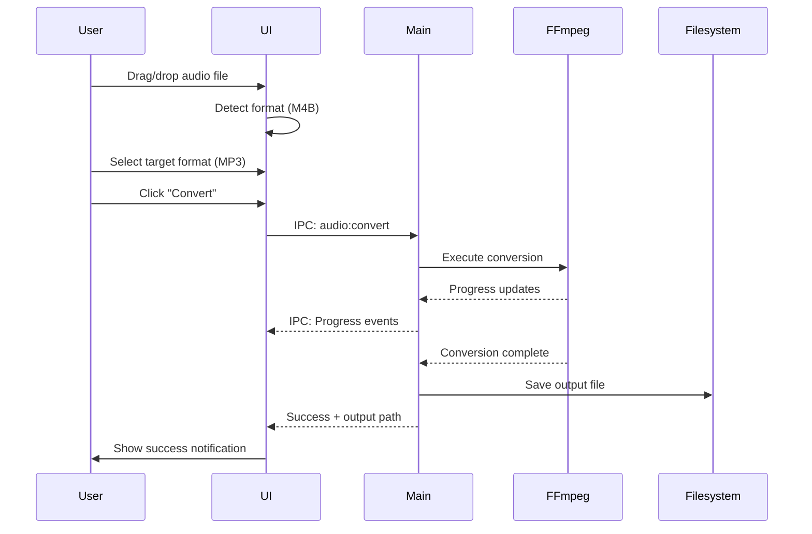

# Format Converter

**Status**: ✅ Implemented (v0.2.0)
**Owner**: Zendevve
**Related ADRs**: [ADR-002](../ADR/ADR-002-ffmpeg-processing-strategy.md)

---

## Purpose

Convert audiobook files between different formats while preserving all metadata and chapters. Supports batch conversion for processing multiple files at once.

---

## Business Rules

1. **Supported Formats**:
   - Input: M4B, M4A, MP3, AAC, FLAC
   - Output: M4B, M4A, MP3, AAC

2. **Metadata Preservation**:
   - All metadata (title, author, genre, narrator, year, cover art) must be preserved during conversion
   - Chapter markers must be preserved for formats that support them

3. **File Naming**:
   - Output files use same basename as input
   - Extension changes to match target format

4. **Batch Processing**:
   - Multiple files can be queued
   - Conversions run sequentially
   - Progress tracked per file

---

## Main Flows

### Happy Path: Single File Conversion



### Batch Conversion

1. User adds multiple files to queue
2. User selects target format (same for all)
3. User clicks "Convert All"
4. System converts files sequentially
5. Progress shown for each file
6. Results list shows success/failure per file

### Error Flows

- **Invalid Input Format**: Show error, reject file
- **Conversion Failure**: Show FFmpeg error, mark file as failed
- **Disk Full**: Show error, stop batch processing
- **Cancelled Mid-Conversion**: Clean up temp files

---

## Test Flows

### Positive Tests

| ID | Scenario | Input | Expected Result | Data |
|----|----------|-------|----------------|------|
| TC-001 | M4B → MP3 | `test.m4b` (64kbps AAC) | `test.mp3` with VBR ~64k, metadata preserved | 5MB test file |
| TC-002 | MP3 → M4B | `test.mp3` (128kbps) | `test.m4b` with AAC 128k, chapters preserved | 10MB with chapters |
| TC-003 | FLAC → M4B | `test.flac` (lossless) | `test.m4b` with AAC 192k, high quality | 50MB lossless |
| TC-004 | Batch: 3 files | `[a.m4b, b.m4b, c.m4b]` → MP3 | All 3 converted successfully | 3x 5MB files |
| TC-005 | Metadata preservation | `book.m4a` with full metadata | All fields intact in output | Complete metadata |
| TC-006 | Cover art preservation | `book.m4b` with 500x500 cover | Cover embedded in output | JPEG cover art |

### Negative Tests

| ID | Scenario | Input | Expected Result | Notes |
|----|----------|-------|----------------|-------|
| TC-101 | Invalid file type | `document.pdf` | Reject with error message | Non-audio file |
| TC-102 | Corrupted audio | `broken.m4b` | FFmpeg error, clear message | Truncated file |
| TC-103 | Disk full | Any file, full disk | Error: "Insufficient space" | Simulate full disk |

### Edge Cases

| ID | Scenario | Input | Expected Result | Notes |
|----|----------|-------|----------------|-------|
| TC-201 | Very large file | `50hour.m4b` (2GB) | Converts with progress | Stress test |
| TC-202 | Special characters in filename | `Title (2024) [Author].m4b` | Output preserves name | Filename handling |
| TC-203 | Same input/output format | `file.mp3` → MP3 | Re-encodes (quality check) | Transcoding test |

---

## Components

### Frontend

- **ConvertStep.tsx**: New wizard step or standalone view
  - File input (drag-and-drop, multi-select)
  - Format selector dropdown
  - Conversion queue list
  - Progress bars per file
  - Results summary

### Backend (Electron Main Process)

- **IPC Handlers** (`electron/main.ts`):
  - `audio:convert` - Single file conversion
  - `audio:batchConvert` - Batch conversion
  - Progress events: `audio:convertProgress`

- **FFmpeg Commands**:
  - Defined in `lib/conversion-presets.ts`
  - Real FFmpeg process (no mocks in tests)

### Data Models

```typescript
interface ConversionRequest {
  inputPath: string;
  outputFormat: 'm4b' | 'm4a' | 'mp3' | 'aac';
  bitrate?: string; // Optional override
}

interface ConversionProgress {
  fileId: string;
  percent: number;
  currentTime: string;
  estimatedTime: string;
}

interface ConversionResult {
  success: boolean;
  inputPath: string;
  outputPath?: string;
  error?: string;
}
```

---

## Definition of Done

- [ ] Feature doc reviewed and approved
- [ ] All positive test flows (TC-001 to TC-006) pass
- [ ] All negative test flows (TC-101 to TC-103) pass
- [ ] All edge case flows (TC-201 to TC-203) pass
- [ ] Integration tests use real FFmpeg (no mocks)
- [ ] UI shows clear progress and error messages
- [ ] Metadata and chapters verified in output files
- [ ] Code follows AGENTS.md rules
- [ ] Documentation updated (README mentions converter)
- [ ] Build and format commands pass

---

## Notes

- FFmpeg must be installed and in PATH (same as Binder)
- Container testing not applicable (desktop app)
- Use real audio files in `test-fixtures/` directory
- Test files should be checked into repo (small, < 10MB each)
